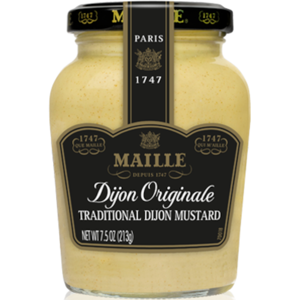

# [Zuurkoolstamppot](https://www.ah.nl/allerhande/recept/R-R1186627/zuurkoolstamppot-met-paddenstoelen-en-dragon)

* 3 tenen knoflook
* 1 kg iets kruimige aardappelen
* 750 g verse zuurkool
* 4 uien
* 15 g verse dragon
* 400 g paddenstoelen voor pasta
* 45 g ongezouten roomboter (alle varianten mogelijk)
* 100 ml halfvolle melk
* 2 el fijne mosterd
* 75 g Parmigiano Reggiano-poeder

| Ingredient | Quantity           | Remark       |
| :--------- | :----------------: | -----------: |
| ![mosterd] | 2 el fijne mosterd |              |

 
 

[mosterd]: images/mosterd-maille-dijon-original.png "Title Text"

